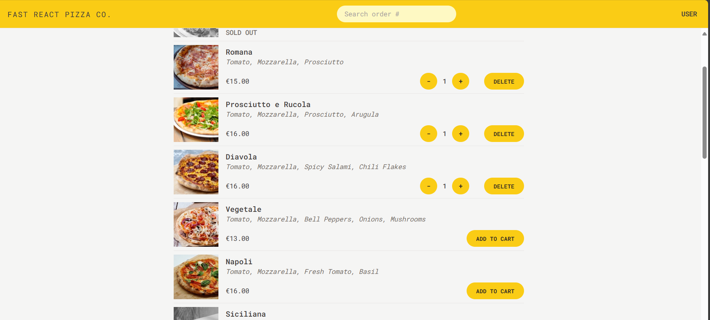

<div align="center">

  <h1>Fast React Pizza 🍕</h1>

  <h3>
    <a href="https://fast-react-pizza-hub.netlify.app/">
      <strong>Demo Website</strong>
    </a>
  </h3>

  <div align="center">
    <a href="https://fast-react-pizza-hub.netlify.app/">View Demo</a>
    •
    <a href="https://github.com/Sujitroy98/the-wild-oasis/issues">Report Bug</a>
  </div>

  <hr>

</div>

<!-- Badges -->
<div align="center">


<a href='https://www.facebook.com/bkp.wale/' target="_blank"></a>
<a href='https://www.linkedin.com/in/sujit-roy-399014229/' target="_blank"></a>

</div>

<!-- Brief -->
<p>The Fast React Pizza ordering App is a modern web application developed using React, Redux for state management, and Tailwind CSS for styling. This app is designed to simplify ordering delicious pizzas and offers the additional convenience of location detection. With an intuitive user interface, users can effortlessly select pizzas from a menu and add them to their cart for a seamless ordering experience.</p>

<!-- Screenshot -->
<a align="center" href="https://the-wild-oasis-hfo.vercel.app/">



</a>


## Key Features

<ul>
  <li><strong>Pizza Selection:</strong> Users can explore various pizzas available on the app. Each pizza is accompanied by enticing visuals and detailed descriptions, making it easy for customers to choose their favourite flavours and toppings.</li>

  <li><strong>Cart Management: </strong>The app allows users to add pizzas to their cart, review their selections, and make adjustments as needed. Users can increase or decrease the quantity of selected pizzas and remove items from their cart.</li>

  <li><strong>Location Detection: </strong>The app incorporates location detection functionality, simplifying the process of specifying the delivery address. Users can share their current location, making it convenient for delivery personnel to reach them.</li>
</ul>

## My process

### Built with

<ul>
  <li><strong>Frontend Framework: </strong>React</li>
  <li><strong>State Management: </strong>Redux Toolkit</li>
  <li><strong>Routing: </strong>React Router</li>
  <li><strong>Styling: </strong>Tailwind CSS</li>
</ul>


### Installation

- Clone this repo:

```sh
git clone https://github.com/Sujitroy98/fast-react-pizza.git
```

- Install dependencies:

```sh
npm install
```

- Build command:

```sh
npm run build
```

- Live server:

```sh
npm run dev
```

### Author

<b>👤 Sujit</b>


- LinkedIn - [@sujit-roy98](https://www.linkedin.com/in/sujit-roy-399014229/)
- Github: [@sujit-roy98](https://github.com/Sujitroy98)

Feel free to contact me with any questions or feedback!

### Acknowledgments

This app was developed as part of the [Udemy course](https://www.udemy.com/course/the-ultimate-react-course) "The Ultimate React Course 2023: React, Redux & More" by [Jonas Smechmann](https://twitter.com/jonasschmedtman). Special thanks to Jonas for his exceptional teaching and guidance during the course.
